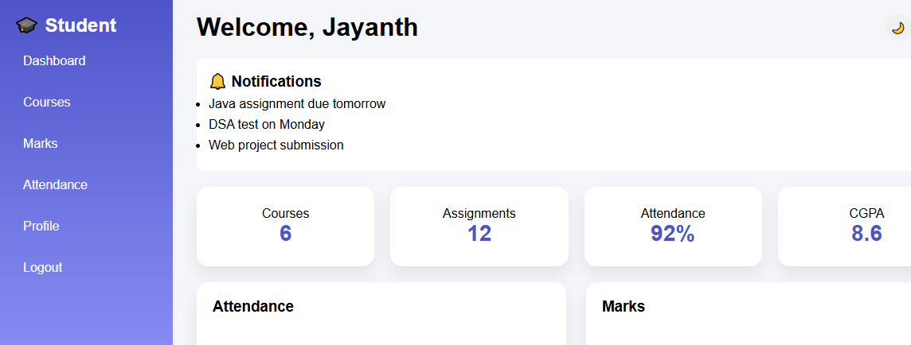
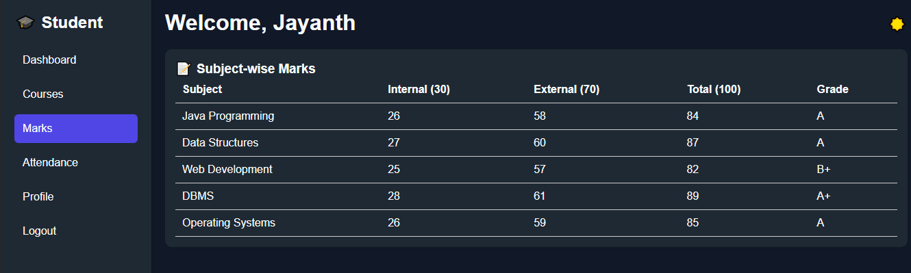
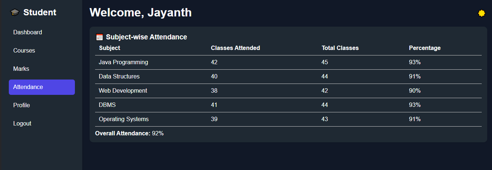

.# Student Performance Dashboard

A full-stack Student Performance Dashboard built with Java ,Spring Boot, MySQL, and Vanilla JS/HTML. Tracks student marks, attendance, grades, and fail reasons. Provides REST APIs for CRUD operations and displays analytics

## Project Overview

The **Student Performance Dashboard** is a full-stack application built using **Java Spring Boot, MySQL, and Vanilla JavaScript/HTML**. It allows teachers and administrators to track student marks, attendance, grades, and generate detailed reports including fail reasons.

This project demonstrates skills in **backend development, database management, REST API design, and full-stack integration** — perfect for a **Java Backend Developer portfolio**.

---

## Objectives

- Build a cloud-ready full-stack application with minimal folder structure.  
- Track student marks, attendance, grades, remarks, and fail reasons.  
- Enable CRUD operations on student data via REST APIs.  
- Provide a simple dashboard interface for data visualization.  
- Demonstrate SQL, Spring Boot, and frontend integration skills.  

---

## Features

- View all students with marks, attendance, grades, remarks, and fail reasons.  
- Automatically calculate total marks, percentage, result, and grade based on predefined logic.  
- REST APIs to retrieve and add students.  
- Dashboard displays students in a responsive HTML table.  
- Fail reason highlights why a student failed (low marks, low attendance, or both).  
- Minimal folder structure for easy understanding and deployment.  

---

## Tech Stack Used

| Layer      | Technology                  |
|-----------|----------------------------|
| Backend   | Java, Spring Boot           |
| Database  | MySQL                       |
| Frontend  | HTML, CSS, JavaScript       |
| ORM / JPA | Spring Data JPA             |
| Build Tool| Maven                       |
| API Testing | Postman / Browser         |

---

## Who Can Benefit

- **Backend Developers:** Showcase REST API and Spring Boot skills.  
- **Database Enthusiasts:** Demonstrate SQL logic, calculated fields, and reporting.  
- **Full-Stack Developers:** Integrate frontend, backend, and database in one project.  
- **Students & Teachers:** Practical application to manage student performance data.  
- **Recruiters:** Evaluate candidate’s full-stack and backend skill set.  

---
## SCREENSHOTS

### Dashboard

### Marks

### Attendance

---
## Future Improvements

- Add edit/update/delete student functionality from the frontend.
- Add charts and analytics (top performers, average class score).
- Integrate authentication for teachers/admin.
- Deploy to AWS / GCP to make it fully cloud-native.
---

## Author

**JAYANTH D R **
